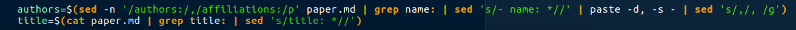
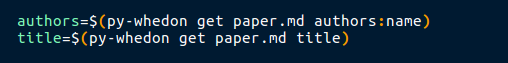

# Whedon Python

[](https://circleci.com/gh/openbases/whedon-python)

This is a small module with helper functions for using Whedon. Please contribute at
[openbases/python-whedon](https://www.github.com/openbases/whedon-python) on
Github.

> Just... no!



> Better!



**under development**

# Installation

```bash
git clone https://www.github.com/openbases/whedon-python
cd whedon-python
python setup.py install
```
```
pip install whedon
```

# Usage

This is a temporary location to document usage (while I'm developing it). 
This will be served via a command line client `py-whedon` and also within
python.

## Papers

### Command Line

Load a paper, show all fields:

```bash
$ py-whedon paper get paper.md
title: The Experiment Factory: Reproducible Experiment Containers
tags: ['containers', 'docker', 'psychology', 'reproducibility', 'Docker']
authors: [{'name': 'Vanessa Sochat', 'orcid': '0000-0002-4387-3819', 'affiliation': 1}]
affiliations: [{'name': 'Stanford University Research Computing', 'index': 1}]
date: 28 November 2017
bibliography: paper.bib
```

Get a specific field

```
$ py-whedon paper get paper.md title
The Experiment Factory: Reproducible Experiment Containers
```

Get a list, render in comma separated list

```
$ py-whedon paper get paper.md tags
containers,docker,psychology,reproducibility,Docker
```

Change the separator to space!

```
$ py-whedon --sep " " paper get paper.md  tags
containers docker psychology reproducibility Docker
```

Get more than one at once:

```
$ py-whedon paper get paper.md title tags
The Experiment Factory: Reproducible Experiment Containers
containers,docker,psychology,reproducibility,Docker
```

Look up a subfield (e.g., authors --> name)

```
$ py-whedon paper get paper.md authors:name
Vanessa Sochat

$ py-whedon paper get paper.md authors:orcid
0000-0002-4387-3819
```

All together now!

```
$ py-whedon paper get paper.md  tags authors:name title
containers,docker,psychology,reproducibility,Docker
Vanessa Sochat
The Experiment Factory: Reproducible Experiment Containers
```


## Interactive

A paper will be available both of these ways:

```
from whedon.main import Paper
paper = Paper("paper.md")
```

or via a client:

```
from whedon.main import get_client
client = get_client("paper.md")
```

The output shows the parsed markdown with paper values

```
title: The Experiment Factory: Reproducible Experiment Containers
tags: ['containers', 'docker', 'psychology', 'reproducibility', 'Docker']
authors: [{'name': 'Vanessa Sochat', 'orcid': '0000-0002-4387-3819', 'affiliation': 1}]
affiliations: [{'name': 'Stanford University Research Computing', 'index': 1}]
date: 28 November 2017
bibliography: paper.bib
```

Since we want to feed these into pandoc, there will be nice functions to return
fields, and subfields, separated by a delimiter of choice.

```
# Get sub fields from list
paper.get('authors', field='name')
Vanessa Sochat
```

Command line will probably look like this
```
py-whedon paper get authors name
authors=$(py-whedon paper get authors name)
```

**under development**

!! This is fun :)
